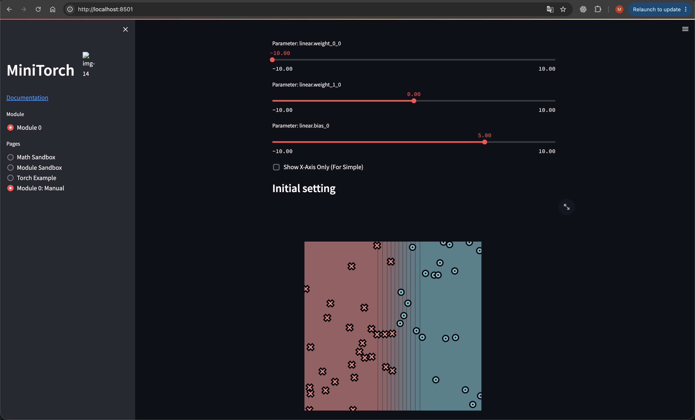

# minitorch
The full minitorch student suite. 


To access the autograder: 

* Module 0: https://classroom.github.com/a/qDYKZff9
* Module 1: https://classroom.github.com/a/6TiImUiy
* Module 2: https://classroom.github.com/a/0ZHJeTA0
* Module 3: https://classroom.github.com/a/U5CMJec1
* Module 4: https://classroom.github.com/a/04QA6HZK
* Quizzes: https://classroom.github.com/a/bGcGc12k

## Module 0

Задачи 0.1, 0.2, 0.3, 0.4 написаны и протестированы.

### Задача 0.5

Датасет: `Simple`.

Параметры:
```text
linear.weight_0_0 = -10.0
linear.weight_1_0 = 0.0
linear.bias_0 = 5.0
```

Эта штука задаёт функцию `sigmoid(-10 * x1 + 5)`, граница решения которой проходит по прямой `x1 = 0.5`.



## Module 1

Задачи 1.1, 1.2, 1.3 и 1.4 написаны и протестированы.

### Задача 1.5: обучение скалярных моделей

Во всех запусках использовались 50 точек, скорость обучения `0.5` и 500 эпох.
Для воспроизводимости указан `seed`.

#### Simple

Параметры: `HIDDEN = 4`, `seed = 3`.

```text
Epoch 100 | loss 5.232619 | correct 48/50
Epoch 200 | loss 2.324147 | correct 48/50
Epoch 300 | loss 2.685251 | correct 48/50
Epoch 400 | loss 0.740643 | correct 50/50
Epoch 500 | loss 0.496871 | correct 50/50
```

#### Diag

Параметры: `HIDDEN = 4`, `seed = 0`.

```text
Epoch 100 | loss 11.275080 | correct 47/50
Epoch 200 | loss 9.782889 | correct 47/50
Epoch 300 | loss 1.570307 | correct 50/50
Epoch 400 | loss 0.532304 | correct 50/50
Epoch 500 | loss 0.267176 | correct 50/50
```

#### Split

Параметры: `HIDDEN = 10`, `seed = 44`.

```text
Epoch 100 | loss 24.943577 | correct 35/50
Epoch 200 | loss 12.097781 | correct 42/50
Epoch 300 | loss 3.945503 | correct 49/50
Epoch 400 | loss 2.968015 | correct 50/50
Epoch 500 | loss 2.301514 | correct 50/50
```

#### Xor

Параметры: `HIDDEN = 10`, `seed = 45`.

```text
Epoch 100 | loss 23.656162 | correct 40/50
Epoch 200 | loss 8.249307 | correct 46/50
Epoch 300 | loss 3.324541 | correct 48/50
Epoch 400 | loss 2.512357 | correct 48/50
Epoch 500 | loss 2.086932 | correct 50/50
```

Как видим, всё корректно работает.
