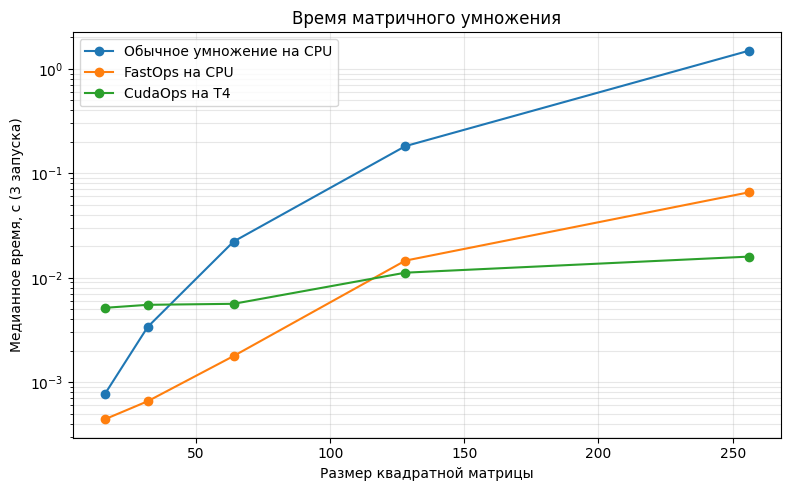

# minitorch
The full minitorch student suite. 


To access the autograder: 

* Module 0: https://classroom.github.com/a/qDYKZff9
* Module 1: https://classroom.github.com/a/6TiImUiy
* Module 2: https://classroom.github.com/a/0ZHJeTA0
* Module 3: https://classroom.github.com/a/U5CMJec1
* Module 4: https://classroom.github.com/a/04QA6HZK
* Quizzes: https://classroom.github.com/a/bGcGc12k

## Module 0

Задачи 0.1, 0.2, 0.3, 0.4 написаны и протестированы.

### Задача 0.5

Датасет: `Simple`.

Параметры:
```text
linear.weight_0_0 = -10.0
linear.weight_1_0 = 0.0
linear.bias_0 = 5.0
```

Эта штука задаёт функцию `sigmoid(-10 * x1 + 5)`, граница решения которой проходит по прямой `x1 = 0.5`.


## Module 1

Задачи 1.1, 1.2, 1.3 и 1.4 написаны и протестированы.

### Задача 1.5

Во всех запусках использовались 50 точек, скорость обучения `0.5` и 500 эпох.
Для воспроизводимости указан `seed`.

#### Simple

Параметры: `HIDDEN = 4`, `seed = 3`.

```text
Epoch 100 | loss 5.232619 | correct 48/50
Epoch 200 | loss 2.324147 | correct 48/50
Epoch 300 | loss 2.685251 | correct 48/50
Epoch 400 | loss 0.740643 | correct 50/50
Epoch 500 | loss 0.496871 | correct 50/50
```

#### Diag

Параметры: `HIDDEN = 4`, `seed = 0`.

```text
Epoch 100 | loss 11.275080 | correct 47/50
Epoch 200 | loss 9.782889 | correct 47/50
Epoch 300 | loss 1.570307 | correct 50/50
Epoch 400 | loss 0.532304 | correct 50/50
Epoch 500 | loss 0.267176 | correct 50/50
```

#### Split

Параметры: `HIDDEN = 10`, `seed = 44`.

```text
Epoch 100 | loss 24.943577 | correct 35/50
Epoch 200 | loss 12.097781 | correct 42/50
Epoch 300 | loss 3.945503 | correct 49/50
Epoch 400 | loss 2.968015 | correct 50/50
Epoch 500 | loss 2.301514 | correct 50/50
```

#### Xor

Параметры: `HIDDEN = 10`, `seed = 45`.

```text
Epoch 100 | loss 23.656162 | correct 40/50
Epoch 200 | loss 8.249307 | correct 46/50
Epoch 300 | loss 3.324541 | correct 48/50
Epoch 400 | loss 2.512357 | correct 48/50
Epoch 500 | loss 2.086932 | correct 50/50
```

Как видим, всё корректно работает (все достигли точности `50/50`).

## Module 2

Задачи 2.1, 2.2, 2.3 и 2.4 написаны и протестированы.

### Задача 2.5

Во всех запусках использовались 50 точек, скорость обучения `0.5` и 500 эпох.
Для воспроизводимости указаны `seed`.

#### Simple

Параметры: `HIDDEN = 4`, `seed = 3`.

```text
Epoch 100 | loss 5.232619 | correct 48/50 | avg_epoch 0.037774s
Epoch 200 | loss 2.324147 | correct 48/50 | avg_epoch 0.037804s
Epoch 300 | loss 2.685251 | correct 48/50 | avg_epoch 0.037866s
Epoch 400 | loss 0.740643 | correct 50/50 | avg_epoch 0.037826s
Epoch 500 | loss 0.496871 | correct 50/50 | avg_epoch 0.037769s
```

#### Diag

Параметры: `HIDDEN = 4`, `seed = 0`.

```text
Epoch 100 | loss 11.275080 | correct 47/50 | avg_epoch 0.037767s
Epoch 200 | loss 9.782889 | correct 47/50 | avg_epoch 0.037846s
Epoch 300 | loss 1.570307 | correct 50/50 | avg_epoch 0.037702s
Epoch 400 | loss 0.532304 | correct 50/50 | avg_epoch 0.037729s
Epoch 500 | loss 0.267176 | correct 50/50 | avg_epoch 0.037782s
```

#### Split

Параметры: `HIDDEN = 10`, `seed = 44`.

```text
Epoch 100 | loss 24.943577 | correct 35/50 | avg_epoch 0.147600s
Epoch 200 | loss 12.097781 | correct 42/50 | avg_epoch 0.147448s
Epoch 300 | loss 3.945503 | correct 49/50 | avg_epoch 0.147243s
Epoch 400 | loss 2.968015 | correct 50/50 | avg_epoch 0.147098s
Epoch 500 | loss 2.301514 | correct 50/50 | avg_epoch 0.147073s
```

#### Xor

Параметры: `HIDDEN = 10`, `seed = 45`.

```text
Epoch 100 | loss 23.656162 | correct 40/50 | avg_epoch 0.147367s
Epoch 200 | loss 8.249307 | correct 46/50 | avg_epoch 0.147033s
Epoch 300 | loss 3.324541 | correct 48/50 | avg_epoch 0.147120s
Epoch 400 | loss 2.512357 | correct 48/50 | avg_epoch 0.146942s
Epoch 500 | loss 2.086932 | correct 50/50 | avg_epoch 0.146901s
```

#### Circle

Параметры: `HIDDEN = 10`, `seed = 46`.

```text
Epoch 100 | loss 13.713270 | correct 41/50 | avg_epoch 0.157746s
Epoch 200 | loss 9.348990 | correct 46/50 | avg_epoch 0.157562s
Epoch 300 | loss 4.910383 | correct 48/50 | avg_epoch 0.157517s
Epoch 400 | loss 5.404404 | correct 47/50 | avg_epoch 0.157364s
Epoch 500 | loss 2.044287 | correct 50/50 | avg_epoch 0.157285s
```

#### Spiral

Параметры: `HIDDEN = 10`, `seed = 47`.

```text
Epoch 100 | loss 33.627556 | correct 29/50 | avg_epoch 0.154377s
Epoch 200 | loss 33.499651 | correct 29/50 | avg_epoch 0.155377s
Epoch 300 | loss 33.478938 | correct 29/50 | avg_epoch 0.157107s
Epoch 400 | loss 33.341339 | correct 29/50 | avg_epoch 0.157914s
Epoch 500 | loss 33.230156 | correct 30/50 | avg_epoch 0.157108s
```

По первым 5 датасетам модель обучилась хорошо (50/50). На `Spiral` при указанных параметрах модель не сошлась за 500 эпох (только 30/50 получилось).

## Module 3

Задачи 3.1, 3.2, 3.3, 3.4 и 3.5 написаны и протестированы.

### Задачи 3.1 и 3.2

Для проверки выполнено:

```shell
python project/parallel_check.py
```

Полный вывод Numba:

```text
MAP

================================================================================
 Parallel Accelerator Optimizing:  Function tensor_map.<locals>._map,
 minitorch/fast_ops.py (154)
================================================================================

Parallel loop listing for Function tensor_map.<locals>._map,
minitorch/fast_ops.py (154)
-----------------------------------------------------------------------------|loop #ID
    def _map(                                                                |
        out: Storage,                                                        |
        out_shape: Shape,                                                    |
        out_strides: Strides,                                                |
        in_storage: Storage,                                                 |
        in_shape: Shape,                                                     |
        in_strides: Strides,                                                 |
    ) -> None:                                                               |
        aligned = len(out_shape) == len(in_shape)                            |
        if aligned:                                                          |
            for dim in range(len(out_shape)):                                |
                if (                                                         |
                    out_shape[dim] != in_shape[dim]                          |
                    or out_strides[dim] != in_strides[dim]                   |
                ):                                                           |
                    aligned = False                                          |
                    break                                                    |
                                                                             |
        if aligned:                                                          |
            for ordinal in prange(len(out)):---------------------------------| #0
                out[ordinal] = fn(in_storage[ordinal])                       |
        else:                                                                |
            for ordinal in prange(len(out)):---------------------------------| #1
                out_index = np.empty(MAX_DIMS, dtype=np.int32)               |
                in_index = np.empty(MAX_DIMS, dtype=np.int32)                |
                to_index(ordinal, out_shape, out_index)                      |
                broadcast_index(out_index, out_shape, in_shape, in_index)    |
                out_position = index_to_position(out_index, out_strides)     |
                in_position = index_to_position(in_index, in_strides)        |
                out[out_position] = fn(in_storage[in_position])              |
--------------------------------- Fusing loops ---------------------------------
Attempting fusion of parallel loops (combines loops with similar properties)...
Following the attempted fusion of parallel for-loops there are 2 parallel for-
loop(s) (originating from loops labelled: #0, #1).
--------------------------------------------------------------------------------
----------------------------- Before Optimisation ------------------------------
--------------------------------------------------------------------------------
------------------------------ After Optimisation ------------------------------
Parallel structure is already optimal.
--------------------------------------------------------------------------------
--------------------------------------------------------------------------------

---------------------------Loop invariant code motion---------------------------
Allocation hoisting:
The memory allocation derived from the instruction at minitorch/fast_ops.py
(177) is hoisted out of the parallel loop labelled #1 (it will be performed
before the loop is executed and reused inside the loop):
   Allocation:: out_index = np.empty(MAX_DIMS, dtype=np.int32)
    - numpy.empty() is used for the allocation.
The memory allocation derived from the instruction at minitorch/fast_ops.py
(178) is hoisted out of the parallel loop labelled #1 (it will be performed
before the loop is executed and reused inside the loop):
   Allocation:: in_index = np.empty(MAX_DIMS, dtype=np.int32)
    - numpy.empty() is used for the allocation.
None

ZIP

================================================================================
 Parallel Accelerator Optimizing:  Function tensor_zip.<locals>._zip,
 minitorch/fast_ops.py (210)
================================================================================

Parallel loop listing for Function tensor_zip.<locals>._zip,
minitorch/fast_ops.py (210)
---------------------------------------------------------------------------------------|loop #ID
    def _zip(                                                                          |
        out: Storage,                                                                  |
        out_shape: Shape,                                                              |
        out_strides: Strides,                                                          |
        a_storage: Storage,                                                            |
        a_shape: Shape,                                                                |
        a_strides: Strides,                                                            |
        b_storage: Storage,                                                            |
        b_shape: Shape,                                                                |
        b_strides: Strides,                                                            |
    ) -> None:                                                                         |
        aligned = len(out_shape) == len(a_shape) and len(out_shape) == len(b_shape)    |
        if aligned:                                                                    |
            for dim in range(len(out_shape)):                                          |
                if (                                                                   |
                    out_shape[dim] != a_shape[dim]                                     |
                    or out_shape[dim] != b_shape[dim]                                  |
                    or out_strides[dim] != a_strides[dim]                              |
                    or out_strides[dim] != b_strides[dim]                              |
                ):                                                                     |
                    aligned = False                                                    |
                    break                                                              |
                                                                                       |
        if aligned:                                                                    |
            for ordinal in prange(len(out)):-------------------------------------------| #2
                out[ordinal] = fn(a_storage[ordinal], b_storage[ordinal])              |
        else:                                                                          |
            for ordinal in prange(len(out)):-------------------------------------------| #3
                out_index = np.empty(MAX_DIMS, dtype=np.int32)                         |
                a_index = np.empty(MAX_DIMS, dtype=np.int32)                           |
                b_index = np.empty(MAX_DIMS, dtype=np.int32)                           |
                to_index(ordinal, out_shape, out_index)                                |
                broadcast_index(out_index, out_shape, a_shape, a_index)                |
                broadcast_index(out_index, out_shape, b_shape, b_index)                |
                out_position = index_to_position(out_index, out_strides)               |
                a_position = index_to_position(a_index, a_strides)                     |
                b_position = index_to_position(b_index, b_strides)                     |
                out[out_position] = fn(                                                |
                    a_storage[a_position], b_storage[b_position]                       |
                )                                                                      |
--------------------------------- Fusing loops ---------------------------------
Attempting fusion of parallel loops (combines loops with similar properties)...
Following the attempted fusion of parallel for-loops there are 2 parallel for-
loop(s) (originating from loops labelled: #2, #3).
--------------------------------------------------------------------------------
----------------------------- Before Optimisation ------------------------------
--------------------------------------------------------------------------------
------------------------------ After Optimisation ------------------------------
Parallel structure is already optimal.
--------------------------------------------------------------------------------
--------------------------------------------------------------------------------

---------------------------Loop invariant code motion---------------------------
Allocation hoisting:
The memory allocation derived from the instruction at minitorch/fast_ops.py
(238) is hoisted out of the parallel loop labelled #3 (it will be performed
before the loop is executed and reused inside the loop):
   Allocation:: out_index = np.empty(MAX_DIMS, dtype=np.int32)
    - numpy.empty() is used for the allocation.
The memory allocation derived from the instruction at minitorch/fast_ops.py
(239) is hoisted out of the parallel loop labelled #3 (it will be performed
before the loop is executed and reused inside the loop):
   Allocation:: a_index = np.empty(MAX_DIMS, dtype=np.int32)
    - numpy.empty() is used for the allocation.
The memory allocation derived from the instruction at minitorch/fast_ops.py
(240) is hoisted out of the parallel loop labelled #3 (it will be performed
before the loop is executed and reused inside the loop):
   Allocation:: b_index = np.empty(MAX_DIMS, dtype=np.int32)
    - numpy.empty() is used for the allocation.
None

REDUCE

================================================================================
 Parallel Accelerator Optimizing:  Function tensor_reduce.<locals>._reduce,
 minitorch/fast_ops.py (273)
================================================================================

Parallel loop listing for Function tensor_reduce.<locals>._reduce,
minitorch/fast_ops.py (273)
------------------------------------------------------------------------|loop #ID
    def _reduce(                                                        |
        out: Storage,                                                   |
        out_shape: Shape,                                               |
        out_strides: Strides,                                           |
        a_storage: Storage,                                             |
        a_shape: Shape,                                                 |
        a_strides: Strides,                                             |
        reduce_dim: int,                                                |
    ) -> None:                                                          |
        for ordinal in prange(len(out)):--------------------------------| #4
            out_index = np.empty(MAX_DIMS, dtype=np.int32)              |
            to_index(ordinal, out_shape, out_index)                     |
            out_position = index_to_position(out_index, out_strides)    |
            a_position = index_to_position(out_index, a_strides)        |
            reduce_stride = a_strides[reduce_dim]                       |
            accumulator = out[out_position]                             |
                                                                        |
            for reduce_index in range(a_shape[reduce_dim]):             |
                accumulator = fn(accumulator, a_storage[a_position])    |
                a_position += reduce_stride                             |
                                                                        |
            out[out_position] = accumulator                             |
--------------------------------- Fusing loops ---------------------------------
Attempting fusion of parallel loops (combines loops with similar properties)...
Following the attempted fusion of parallel for-loops there are 1 parallel for-
loop(s) (originating from loops labelled: #4).
--------------------------------------------------------------------------------
----------------------------- Before Optimisation ------------------------------
--------------------------------------------------------------------------------
------------------------------ After Optimisation ------------------------------
Parallel structure is already optimal.
--------------------------------------------------------------------------------
--------------------------------------------------------------------------------

---------------------------Loop invariant code motion---------------------------
Allocation hoisting:
The memory allocation derived from the instruction at minitorch/fast_ops.py
(283) is hoisted out of the parallel loop labelled #4 (it will be performed
before the loop is executed and reused inside the loop):
   Allocation:: out_index = np.empty(MAX_DIMS, dtype=np.int32)
    - numpy.empty() is used for the allocation.
None

MATRIX MULTIPLY

================================================================================
 Parallel Accelerator Optimizing:  Function _tensor_matrix_multiply,
 minitorch/fast_ops.py (299)
================================================================================

Parallel loop listing for Function _tensor_matrix_multiply,
minitorch/fast_ops.py (299)
----------------------------------------------------------------------------|loop #ID
def _tensor_matrix_multiply(                                                |
    out: Storage,                                                           |
    out_shape: Shape,                                                       |
    out_strides: Strides,                                                   |
    a_storage: Storage,                                                     |
    a_shape: Shape,                                                         |
    a_strides: Strides,                                                     |
    b_storage: Storage,                                                     |
    b_shape: Shape,                                                         |
    b_strides: Strides,                                                     |
) -> None:                                                                  |
    """                                                                     |
    NUMBA tensor matrix multiply function.                                  |
                                                                            |
    Should work for any tensor shapes that broadcast as long as             |
                                                                            |
    ```                                                                     |
    assert a_shape[-1] == b_shape[-2]                                       |
    ```                                                                     |
                                                                            |
    Optimizations:                                                          |
                                                                            |
    * Outer loop in parallel                                                |
    * No index buffers or function calls                                    |
    * Inner loop should have no global writes, 1 multiply.                  |
                                                                            |
                                                                            |
    Args:                                                                   |
        out (Storage): storage for `out` tensor                             |
        out_shape (Shape): shape for `out` tensor                           |
        out_strides (Strides): strides for `out` tensor                     |
        a_storage (Storage): storage for `a` tensor                         |
        a_shape (Shape): shape for `a` tensor                               |
        a_strides (Strides): strides for `a` tensor                         |
        b_storage (Storage): storage for `b` tensor                         |
        b_shape (Shape): shape for `b` tensor                               |
        b_strides (Strides): strides for `b` tensor                         |
                                                                            |
    Returns:                                                                |
        None : Fills in `out`                                               |
    """                                                                     |
    a_batch_stride = a_strides[0] if a_shape[0] > 1 else 0                  |
    b_batch_stride = b_strides[0] if b_shape[0] > 1 else 0                  |
                                                                            |
    for ordinal in prange(len(out)):----------------------------------------| #5
        batch = ordinal // (out_shape[1] * out_shape[2])                    |
        row = (ordinal // out_shape[2]) % out_shape[1]                      |
        column = ordinal % out_shape[2]                                     |
                                                                            |
        out_position = (                                                    |
            batch * out_strides[0]                                          |
            + row * out_strides[1]                                          |
            + column * out_strides[2]                                       |
        )                                                                   |
        a_position = batch * a_batch_stride + row * a_strides[1]            |
        b_position = batch * b_batch_stride + column * b_strides[2]         |
        accumulator = 0.0                                                   |
                                                                            |
        for _ in range(a_shape[2]):                                         |
            accumulator += a_storage[a_position] * b_storage[b_position]    |
            a_position += a_strides[2]                                      |
            b_position += b_strides[1]                                      |
                                                                            |
        out[out_position] = accumulator                                     |
--------------------------------- Fusing loops ---------------------------------
Attempting fusion of parallel loops (combines loops with similar properties)...
Following the attempted fusion of parallel for-loops there are 1 parallel for-
loop(s) (originating from loops labelled: #5).
--------------------------------------------------------------------------------
----------------------------- Before Optimisation ------------------------------
--------------------------------------------------------------------------------
------------------------------ After Optimisation ------------------------------
Parallel structure is already optimal.
--------------------------------------------------------------------------------
--------------------------------------------------------------------------------

---------------------------Loop invariant code motion---------------------------
Allocation hoisting:
No allocation hoisting found
None
```

### Задача 3.4



### Задача 3.5

Обучение выполнено в колабе на T4. Во всех запусках использовались 50 точек, `HIDDEN = 100`, скорость обучения `0.05` и 500 эпох. Первая эпоха с компиляцией использовалась для прогрева (ладно, не буду шутить) и не учитывалась при вычислении среднего.

#### Simple

Параметры: `seed = 3`.

```text
Epoch 500 | loss 0.773075 | correct 50/50 | avg_epoch 0.921624s
```

#### Split

Параметры: `seed = 44`.

```text
Epoch 500 | loss 2.457400 | correct 49/50 | avg_epoch 0.916167s
```

#### Xor

Параметры: `seed = 45`.

```text
Epoch 500 | loss 1.972438 | correct 49/50 | avg_epoch 0.895729s
```
